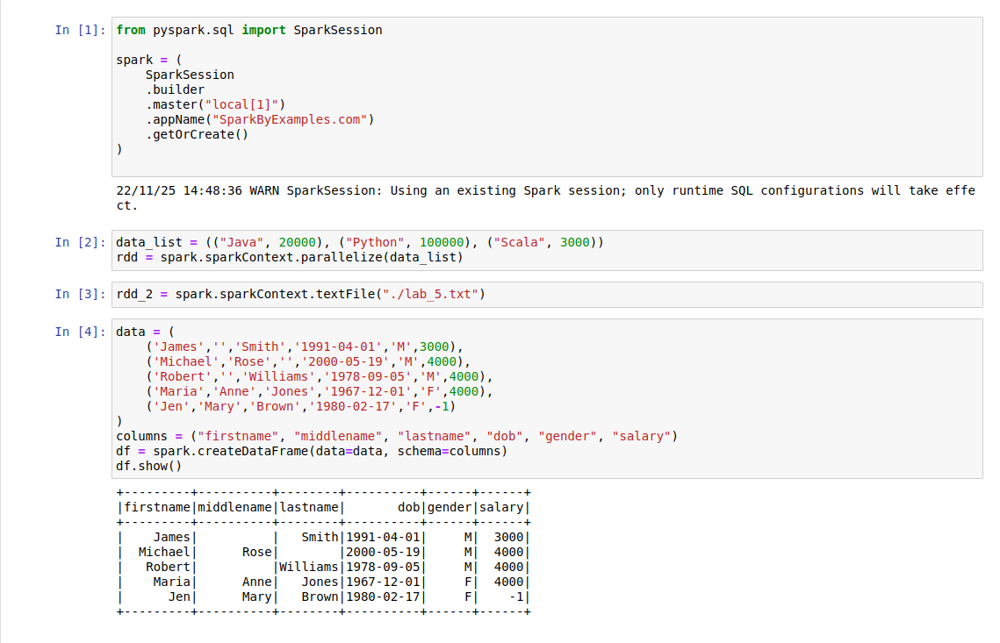
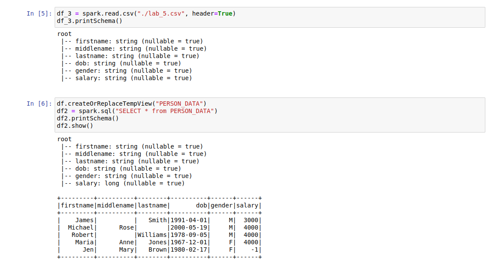
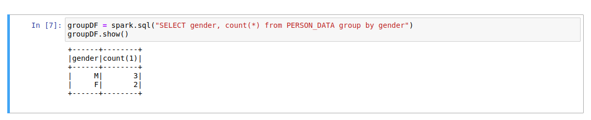

# `BigData` Практична робота №5.

## Завдання
Налаштувати та перевірити Spark за [туторіалом](https://sparkbyexamples.com/pyspark-tutorial/).

## Результат роботи
1. Встановлюємо `PySpark`. Моя операційна система - Ubuntu, тому довелося встановлювати з [іншого туторіалу](https://towardsdatascience.com/installing-pyspark-with-java-8-on-ubuntu-18-04-6a9dea915b5b).
2. Налаштування `Spark History Server` виконував повністю за гайдом.
```bash
➜  ~ cat ~/spark-3.3.1-bin-hadoop3/conf/spark-defaults.conf
spark.eventLog.enabled true
spark.history.fs.logDirectory file:///home/o.kyba/Spark/logs
```
```bash
➜  ~ $SPARK_HOME/sbin/start-history-server.sh
starting org.apache.spark.deploy.history.HistoryServer, logging to /home/o.kyba/spark-3.3.1-bin-hadoop3/logs/spark-root-org.apache.spark.deploy.history.HistoryServer-1-okyba.out
```
3. Запускаємо `PySpark`.
```bash
➜  spark-3.3.1-bin-hadoop3 pyspark                   
[I 12:44:14.191 NotebookApp] Обслуживание блокнотов из локального каталога: /home/o.kyba/spark-3.3.1-bin-hadoop3
[I 12:44:14.191 NotebookApp] Jupyter Notebook 6.4.8 is running at:
[I 12:44:14.191 NotebookApp] http://localhost:8888/?token=dbf86504313569672a733348cb9dc3183ac8c8bdd66963f4
[I 12:44:14.191 NotebookApp]  or http://127.0.0.1:8888/?token=dbf86504313569672a733348cb9dc3183ac8c8bdd66963f4
[I 12:44:14.191 NotebookApp] Используйте Control-C, для остановки этого сервера и выключения всех ядер (дважды, чтобы пропустить подтверждение).
```
3. Після запуску pyspark автоматично запускається `Jupiter Notebook` сервер. Переходимо до [Lab_5.ipynb](./Lab_5.ipynb) з командами практичної роботи. Виконуємо їх.





## Проблеми з якими зіштовхнувся
1. В туторіалі не було показано налаштування `PySpark` для `Ubuntu`, тому інструкцію довелося шукати самостійно.
2. Були проблеми сумісності версії `PySpark` та `python`. Довелося понизити версію python з `3.10` до `3.9`.

## Висновки
Виконуючи цю практичну роботу, я налаштував PySpark для своєї операційної системи. 
Ознайомився з концепціями та операторами `RDD`, `DataFrame`.
Розглянув `PySpark SQL` модуль.